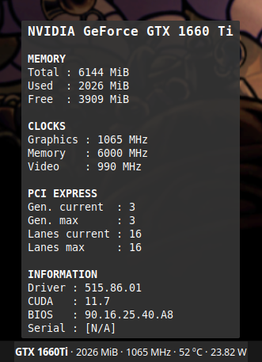
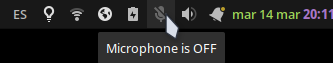
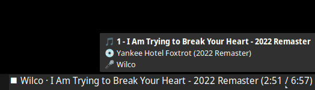
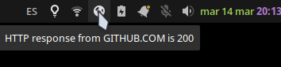
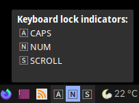

# Panel Monitoring Scripts

A collection of scripts for your [`xfce4-genmon-plugin`](https://docs.xfce.org/panel-plugins/xfce4-genmon-plugin/start) and [`tint2`](https://gitlab.com/o9000/tint2) panels.

# `xfce4-genmon-plugin`

## `gpu_nvidia.sh` - Nvidia GPU Monitor



Uses `nvidia-smi` to show information about the current state of your Nvidia GPU.

> NOTE: This script has not been tested with multiple GPUs

### On Click

Opens `nvidia-settings`

### Panel
`1203 MiB · 1065 MHz · 43 ℃ · 22.68 W`

### Tooltip

```
NVIDIA GeForce GTX 1660 Ti

MEMORY
Total : 6144 MiB
Used  : 1203 MiB
Free  : 4732 MiB

CLOCKS
Graphics : 1065 MHz
Memory   : 6000 MHz
Video    : 990 MHz

PCI EXPRESS
Gen. current  : 3
Gen. max      : 3
Lanes current : 16
Lanes max     : 16

INFORMATION
Driver : 510.73.05
CUDA   : 11.6
BIOS   : 90.16.25.40.A8
Serial : [N/A]
```


## `mic_status.sh` - Microphone status indicator



Uses `amixer` to get the status of your microphone

### On Click

Uses `scripts/mute_toggle` to toggle between Muted/Unmuted using `amixer`

### Panel

Shows a symbolic icon:
- `audio-input-microphone` when mic is ON
- `microphone-sensitivity-muted` when mic is MUTED

### Tooltip

`Microphone is {ON|OFF}`


## `spotify_now_playing.sh` - Now Playing information from Spotify



Uses `playerctl` to show information about the current song that is playing on Spotify.

> NOTE: `playerctl` may get confused if you're playing multiple songs or videos in different applications

### On Click

- If Spotify is running: Pause or resume playing
- If Spotify is closed: Opens Spotify

### Panel

- When a song is playing:

  ```{⯈|⏸} {Artist} · {Title} ({Current_Time}/{Total_Time})```

- When Spotify is closed:

  ```⯀ Click to open Spotify```

### Tooltip

- When a song is playing:

  ```
  🎵 ${TRACK_NUMBER} - ${TITLE}"
  💿 ${ALBUM}
  🎤 ${ARTIST}
  ```

- When Spotify is closed:

  ```Click to open Spotify```


## `internet_check_curl.sh` - Internet status



Uses `curl` to get an HTTP response from a preset website, if `200` then everything is ok.

### On Click

Uses `xdg-open` to open the url of your router so you can troubleshoot the problem

### Panel

Shows a symbolic icon:
- `network-connect` when response from `$HOST` is 200
- `network-error` when `curl` times out or the HTTP response is not 200

### Tooltip

- If connected: `HTTP response from $HOST is $HTTP_RESPONSE</tool>`
- If error: `No HTTP response from $HOST`


## `keyboard_led.sh` - Keyboard indicators



Uses `xset` to get the status of your CAPS/MAYUS, NUM and SCROLL lock keys.

### On Click

Opens `xfce4-keyboard-settings`

### Panel

` 🄰  🄽  🅂 `

Indicators change their background color when ON

### Tooltip

```
Keyboard indicators:
 🄰 CAPS
 🄽 NUM
 🅂 SCROLL
```
